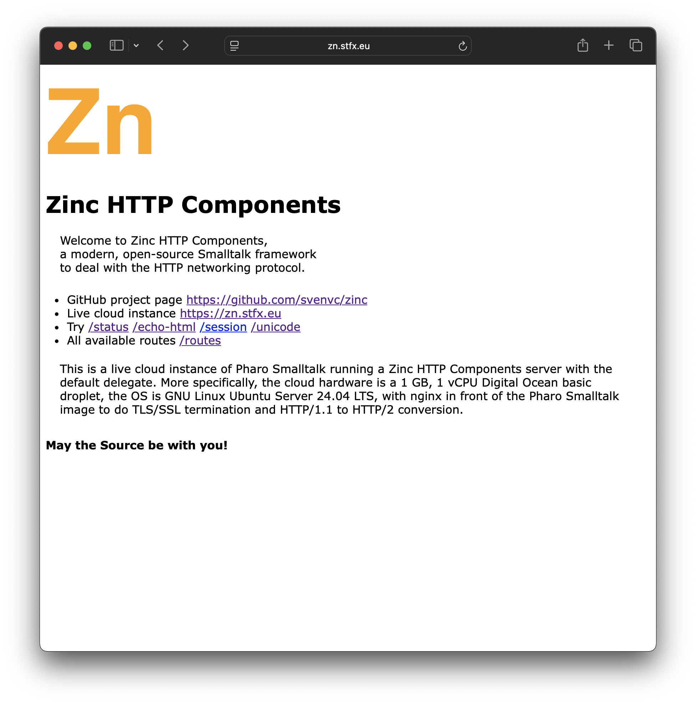
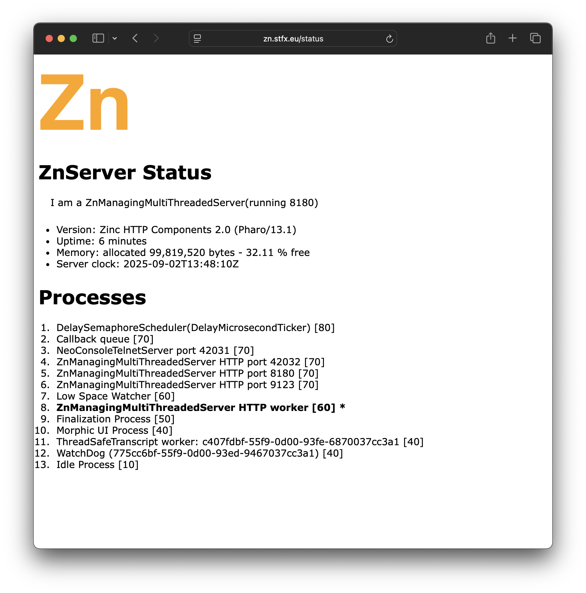

# Upgraded/updated Zinc HTTP Components’ server demo

September 1, 2025.

Since the summer of 2011, with the release of Pharo Smalltalk version 1.3, 
Zinc HTTP Components has been an essential and critical part of the image. 
It has been in development ever since.

Part of Zinc is a standard HTTP/1.1 server. 
You can run it with one line of code. 
Out of the box, its default delegate offers some demos and support for testing.

In the spirit of eating your own dogfood, a live cloud demo was set up, publicly hosting the same setup.

However, both the demo and the way it was deployed haven’t changed much in many years. 
It was still using Pharo 7, released in 2019! 
Hence I decided to give it some much need love.

The new upgraded/updated Zinc server demo can be found at the same address as ever: https://zn.stfx.eu

The main welcome page has been redone and all HTML pages are branded the same. 
Many pages were reworked and simplified. 
For example the status page is now clearer and easier to read.

The list of processes now has a stable sorting, 
a simplified representation of each process 
and includes the marked active process.

