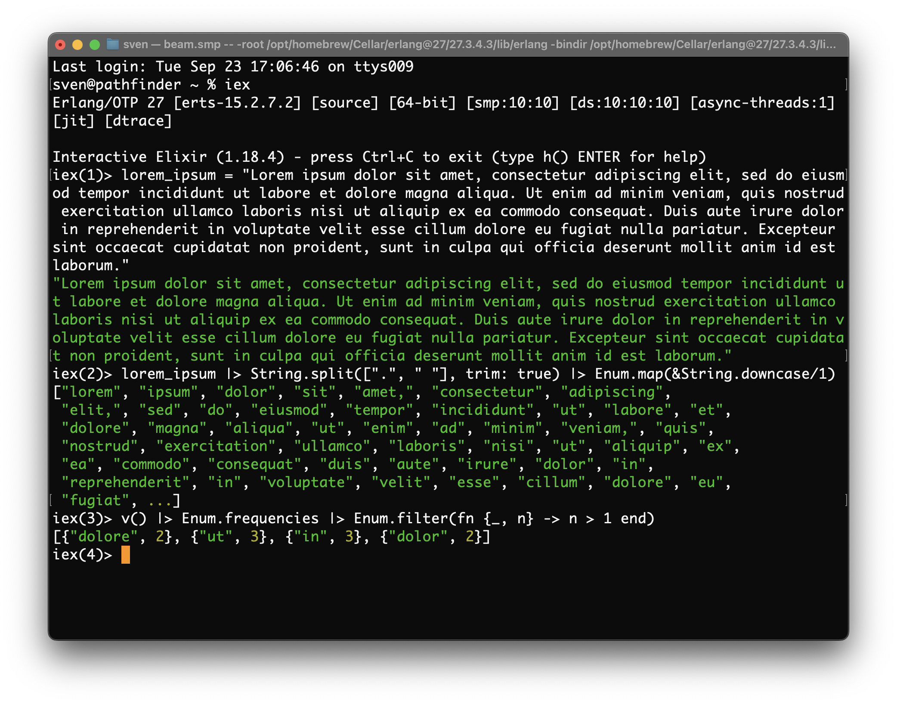
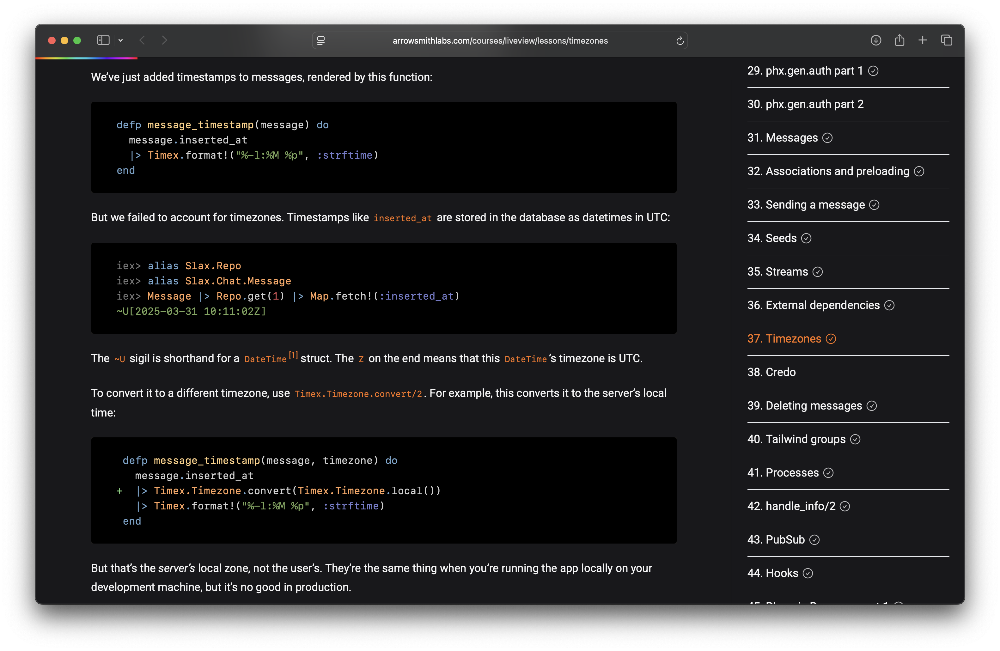
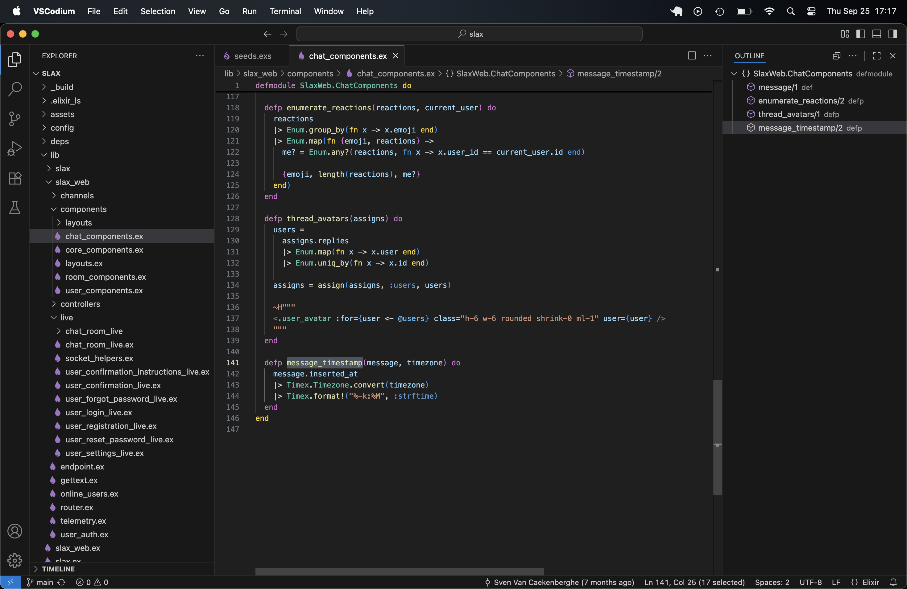

# My journey learning Elixir Phoenix LiveView

Sept 25, 2025

There is a learning curve to get started with the Elixir Phoenix LiveView stack and to appreciate what makes it such a nice environment. I want to share my journey learning Elixir Phoenix LiveView and the resources that I used. Things may feel overwhelming but there is great material out there.

Elixir is the programming language, Phoenix is the web application and web service framework and LiveView is the part of Phoenix to build interactive real-time web applications. I am assuming you are coming from a web software development background, read great things about this environment and want to dive in.

You won’t be building incredibly sophisticated web apps in 15 or 30 minutes like you can see in YouTube videos. There is some serious learning to be done. It will take a while before you get it, before things click. Think weeks or months.

Step one is obviously learning the Elixir programming language itself. To get a basic idea, I would start with the following two links.

- [The Elixir programming language](https://elixir-lang.org) - the official main website
- [Elixir (programming language)](https://en.wikipedia.org/wiki/Elixir_(programming_language)) - the Wikipedia article

I found this particular tutorial really nice to do, it takes less than an hour.

- [RunElixir - A Quickstart Guide to Elixir](https://runelixir.com) - an excellent first tutorial

Start by learning to use `iex`, Elixir’s interactive shell. It is a friendly way to experiment and learn. It has completion, shows popup documentations, colored output (not preserved in the code blocks of this blog), a help system and a history log, and much more. Working in steps allows you to build up expressions as you go.

```
% iex  
Erlang/OTP 27 [erts-15.2.7.2] [source] [64-bit] [smp:10:10] [ds:10:10:10] [async-threads:1] [jit] [dtrace]

Interactive Elixir (1.18.4) - press Ctrl+C to exit (type h() ENTER for help)
iex(1)> DateTime.utc_now
~U[2025-09-25 12:33:32.574210Z]
iex(2)> i
Term
  ~U[2025-09-25 12:33:32.574210Z]
Data type
  DateTime
Description
  This is a struct representing a datetime. It is commonly
  represented using the `~U` sigil syntax, that is
  defined in the `Kernel.sigil_U/2` macro.
Raw representation
  %DateTime{year: 2025, month: 9, day: 25, hour: 12, minute: 33, second: 32, time_zone: "Etc/UTC", zone_abbr: "UTC", utc_offset: 0, std_offset: 0, microsecond: {574210, 6}, calendar: Calendar.ISO}
Reference modules
  DateTime, Calendar, Map
Implemented protocols
  IEx.Info, Inspect, JSON.Encoder, String.Chars
```

Here we ask for the current timestamp, which is printed using a special construct. Next, we type `i` to inspect the last result. This tells us lots of interesting things, for example the fields of the underlying raw representation. With `h` you can ask for a function’s documentation.

```
iex(3)> h DateTime.utc_now

def utc_now(calendar_or_time_unit \\ Calendar.ISO)               

  @spec utc_now(
          Calendar.calendar()
          | :native
          | :microsecond
          | :millisecond
          | :second
        ) :: t()

Returns the current datetime in UTC.

If you want the current time in Unix seconds, use System.os_time/1 instead.

You can also pass a time unit to automatically truncate the resulting datetime.
This is available since v1.15.0.

The default unit if none gets passed is :native, which results on a default resolution of microseconds.

## Examples

    iex> datetime = DateTime.utc_now()
    iex> datetime.time_zone
    "Etc/UTC"
    
    iex> datetime = DateTime.utc_now(:second)
    iex> datetime.microsecond
    {0, 0}


def utc_now(time_unit, calendar)                        

  @spec utc_now(
          :native | :microsecond | :millisecond | :second,
          Calendar.calendar()
        ) :: t()

since: 1.15.0

Returns the current datetime in UTC, supporting a specific calendar and precision.

If you want the current time in Unix seconds, use System.os_time/1 instead.

## Examples

    iex> datetime = DateTime.utc_now(:microsecond, Calendar.ISO)
    iex> datetime.time_zone
    "Etc/UTC"
    
    iex> datetime = DateTime.utc_now(:second, Calendar.ISO)
    iex> datetime.microsecond
    {0, 0}
```

Nice! 

How would a DateTime structure be rendered as JSON ?

```
iex(4)> DateTime.utc_now |> JSON.encode!
"\"2025-09-25T12:34:56.522668Z\""
iex(5)> i
Term
  "\"2025-09-25T12:34:56.522668Z\""
Data type
  BitString
Byte size
  29
Description
  This is a string: a UTF-8 encoded binary. It's printed surrounded by "double quotes" because all UTF-8 encoded code points in it are printable.
Raw representation
  <<34, 50, 48, 50, 53, 45, 48, 57, 45, 50, 53, 84, 49, 50, 58, 51, 52, 58, 53, 54, 46, 53, 50, 50, 54, 54, 56, 90, 34>>
Reference modules
  String, :binary
Implemented protocols
  Collectable, IEx.Info, Inspect, JSON.Encoder, List.Chars, String.Chars
```

Note the use of the piping construct, `|>`, it takes the result of the expression on the left and uses it as first argument to the expression on the right. This is a very common idiom in Elixir’s functional programming paradigm.

The inspect shows there might be something more to learn as it seems strings are a bit special, regarding their internal and external presentations, though in practice things work as expected.

When starting something new, a cheat sheet can be quite useful. I found the next one very helpful in the beginning.

- [Elixir cheatsheet](https://devhints.io/elixir) - a nice one page language & library summary

Here is another `iex` session where we answer the question: in the most common Lorem Ipsum placeholder string, which words occur more than once ?

```
iex(1)> lorem_ipsum = "Lorem ipsum dolor sit amet, consectetur adipiscing elit, sed do eiusmod tempor incididunt ut labore et dolore magna aliqua. Ut enim ad minim veniam, quis nostrud exercitation ullamco laboris nisi ut aliquip ex ea commodo consequat. Duis aute irure dolor in reprehenderit in voluptate velit esse cillum dolore eu fugiat nulla pariatur. Excepteur sint occaecat cupidatat non proident, sunt in culpa qui officia deserunt mollit anim id est laborum."
"Lorem ipsum dolor sit amet, consectetur adipiscing elit, sed do eiusmod tempor incididunt ut labore et dolore magna aliqua. Ut enim ad minim veniam, quis nostrud exercitation ullamco laboris nisi ut aliquip ex ea commodo consequat. Duis aute irure dolor in reprehenderit in voluptate velit esse cillum dolore eu fugiat nulla pariatur. Excepteur sint occaecat cupidatat non proident, sunt in culpa qui officia deserunt mollit anim id est laborum."
iex(2)> lorem_ipsum |> String.split([".", " "], trim: true) |> Enum.map(&String.downcase/1)
["lorem", "ipsum", "dolor", "sit", "amet,", "consectetur", "adipiscing", "elit,", "sed", "do", "eiusmod", "tempor", "incididunt", "ut", "labore", "et", "dolore", "magna", "aliqua", "ut", "enim", "ad", "minim", "veniam,", "quis", "nostrud", "exercitation", "ullamco", "laboris", "nisi", "ut", "aliquip", "ex", "ea", "commodo", "consequat", "duis", "aute", "irure", "dolor", "in", "reprehenderit", "in", "voluptate", "velit", "esse", "cillum", "dolore", "eu", "fugiat", ...]
iex(3)> v() |> Enum.frequencies |> Enum.filter(fn {_, n} -> n > 1 end)
[{"dolore", 2}, {"ut", 3}, {"in", 3}, {"dolor", 2}]
``` 

After assigning a string to a variable, we split it using space and dot characters and remove all empty parts, finally we downcase all parts.

The final expression uses `v()` to pick up the last result and continue using it. We ask for the frequency of all elements in the enumeration and filter it to select those that occur more than once. The filter function uses pattern matching to destruct the elements it iterates over. In a terminal on macOS the colored output looks as follows.



What is special about the RunElixir tutorial is that it is written in the same format and layout of the standard Elixir documentation. In fact, it is one of the remarkable things about the Elixir ecosystem: all documentation is uniform and of high quality.

- [Elixir](https://hexdocs.pm/elixir) - the standard Elixir language & library documentation (hexdocs)
- [Hexdocs](https://hexdocs.pm) - home page for all things documentation related

Remember how we earlier invoked help on the `DateTime.utc_now` function in `hex`. Well, that exact same documentation lives on the web: [DateTime.utc_now/1’s documentation](https://hexdocs.pm/elixir/DateTime.html#utc_now/1).

For most libraries and frameworks, there are both `Guides` and `Modules` sections. The Guides sections are narrative pages giving high level descriptions. The Modules sections are more like classic autogenerated API documentation. You will keep on going back to the `Functions` subsection of a module, where each available function is documented in detail.

There is much to learn about Elixir, the language, but you only need the basics to be able to move on. You will learn more as you go along, looking up things you don’t (fully) understand (yet).

Let’s step up to the next level of our stack, the Phoenix Framework, with LiveView.

- [Phoenix Framework](https://phoenixframework.org) - main website
- [Phoenix](https://hexdocs.pm/phoenix) - the standard Phoenix documentation (hexdocs)
- [Phoenix LiveView](https://hexdocs.pm/phoenix_live_view) - the standard Phoenix LiveView documentation (hexdocs)

This all looks nice, but where to begin? I had the same problem, luckily George Arrowsmith started releasing his courses around that time. These are commercial, to pay for courses, but they are so worth it. This is how I gave feedback afterwards:

> This is probably one of the very best online courses/tutorials I have ever taken. It is beautiful, fun, engaging, interesting, just the right level and it covers a lot of ground. Thanks George, great work! 

The main course is

- [Learn Phoenix LiveView](https://learnphoenixliveview.com)

There is also an equally good, advanced follow up that is about much more than just forms (check the table of contents)

- [Mastering Phoenix forms](https://masteringphoenixforms.com)

You might be skeptical and so you should. There is an easy solution to this: there is a shorter course in the same style that is totally free

- [LiveView and OTP crash course](https://liveviewcrashcourse.com)

There is a good offer to buy the 2 courses in a package deal.

Mind you, this is serious stuff that will take weeks to complete. You will build real working projects, checking in code to GitHub. George explains everything carefully, showing you how things work internally, in manageable steps. He does not skip on the hard stuff. The two courses taken together cover and lot of ground, as their tables of contents can attest to.

Here is a screenshot of a part of a page/chapter in the main course.



It explains how we did render timestamps earlier, not taking into account the user’s timezone and how to fix this. George starts by referring to earlier code that needs changing and why. He uses `iex` sessions to explain his point. Make sure to try these yourself as it is a great tool to understand your code. Then he suggests changes/edits with a clear diff. Often, as is the case here, he makes you try one thing, only to explain why that is not the whole solution, to let you learn by experiencing the development process.

At one point you should properly set up an IDE. Here is the [VSCodium](https://vscodium.com) IDE with the extensions [ElixirLS](https://open-vsx.org/extension/elixir-lsp/elixir-ls), [Phoenix Framework](https://open-vsx.org/vscode/item?itemName=victorbjorklund.phoenix) and [Tailwind CSS Intellisense](https://open-vsx.org/extension/bradlc/vscode-tailwindcss). The details are outside the scope of this article though. It is showing the final version of the `message_timestamp` code.



Take your time to enjoy these beautiful courses. Don’t skip steps. Lookup everything you don’t understand or that otherwise interests you. I guarantee you it will be worth it. Afterwards you should be able to start your first real Elixir Phoenix LiveView project.
