# Explaining Zinc HTTP Components in Glamorous Toolkit

[Glamorous Toolkit](https://gtoolkit.com) (GT) is [feenk](https://feenk.com)’s environment for [Moldable Development](https://moldabledevelopment.com) (MD), an effort to make the inside of software systems explainable through contextual micro tools built for each problem.

Just a couple of these micro tools, mostly custom views, combined with what is already there, massively improve the explainability of Zinc HTTP Components (Zinc, Zn).

The goal of this article is to show you a couple of examples of how things are different in GT with respect to Zinc. You can [download GT](https://gtoolkit.com/download/) for free and experience the examples for yourself.

Let’s start by exploring what an HTTP GET is from a client’s perspective. We do not just execute the GET for its result, we want to see inside the `ZnClient` itself, hence the `yourself` message.

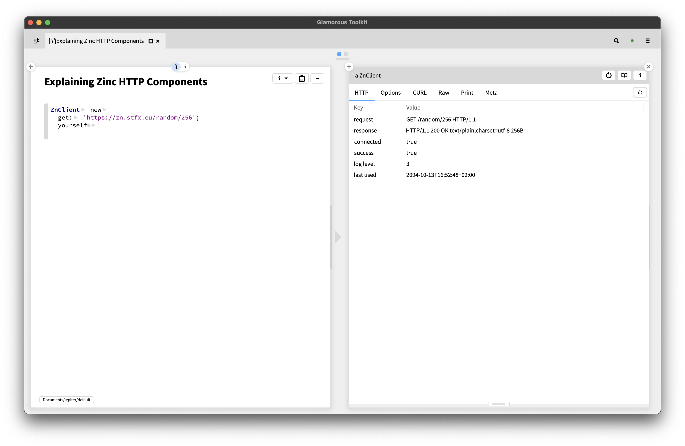

The inspector tabs before `Raw` are custom views. The main view called `HTTP` is a summary. It shows us that a request took place that resulted in a response. The response is qualified as a success. The connection with the server is still open. There is a power off button that allows you to close the open connection.

This is plain list of property keys and values. Selecting a line spawns an inspector view on another object, normally the value, but it can be anything. The connected property has a boolean value, but leads us to a network stream object for the connection.   

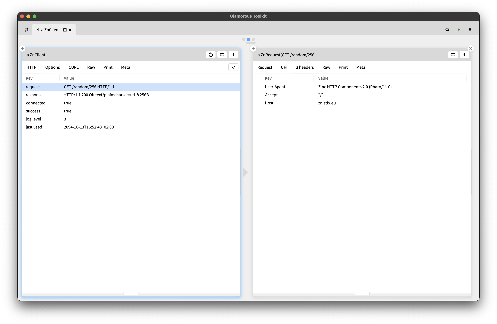

Each HTTP message, request or response, has a number of headers. There is a view to look at the headers. You can option-click a view’s tab to look at the source.

 

The `ZnRequest` object inherits this view from its parent, `ZnMessage`. Inside it, the headers are kept in a helper object, `ZnHeaders`. So the view’s implementation is simple: it reuses the view defined on the helper object. The helper object is doing something similar: it reuses the view defined on `ZnOrderDictionary` since that is how the headers are stored internally. Note that the source code view is clever enough to show us all 3 methods!

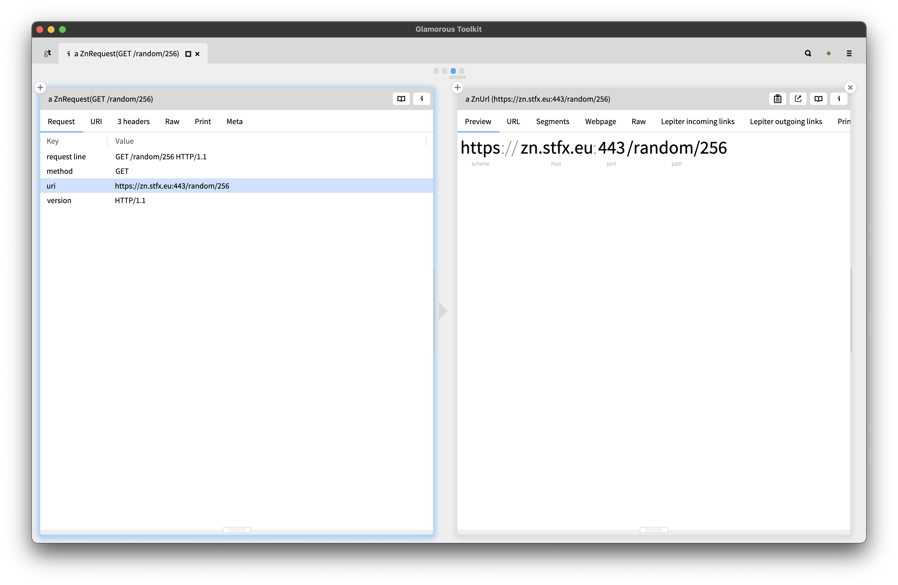

A request refers to a URI/URL, yet another object. You can see how its primary view show a nice visual interpretation of the different parts of the `ZnUrl`, naming each part.

There are two action buttons: one to copy the URL and another to open the URL in your OS’ default web browser. You can inspect the source code behind an action with the same option-click.

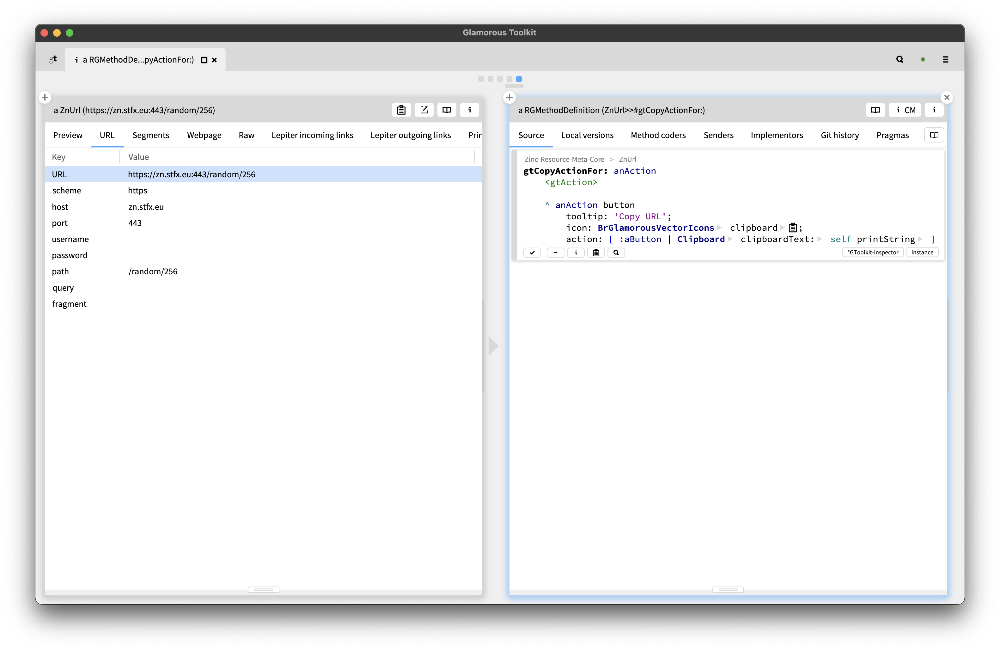

These are simple additions. The idea is that you adapt the environment and the tools to best suite your needs. Taken together, and there are thousands of these, the utility increases significantly. 

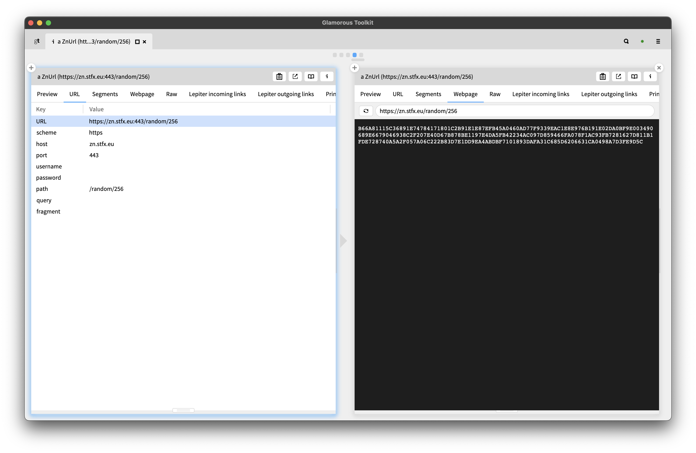

Not only is it possible to open a URL with an external browser, there is a built-in native web view, an internal browser, that can open the page directly in the custom view.

An HTTP server is another object, a subclass of `ZnServer`. There is a default server you can use and easily refer to.

The main view tells us the server is up and running. There are buttons to start and stop the server. The server knows its local url, through which we can see what is being served, reusing the web page view we saw earlier. 

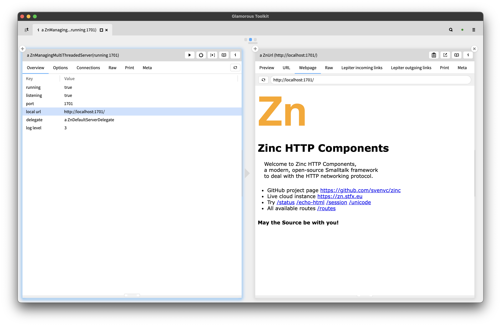

How a server responds to requests is defined by its delegate. Out of the box, this is an instance of `ZnDefaultServerDelegate`. This object has a router that maps prefixes onto methods it implements, or optionally to blocks. A custom view makes this clear.

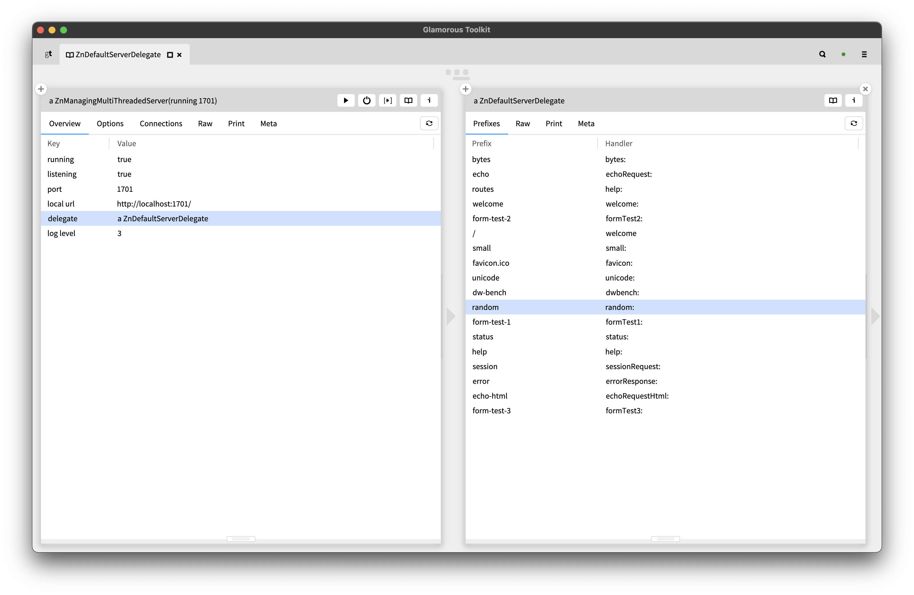

There are quite a few settings that influence how a server works. These settings are a combination of an older and a newer internal implementation. And it is cumbersome to get an overview of all of them.

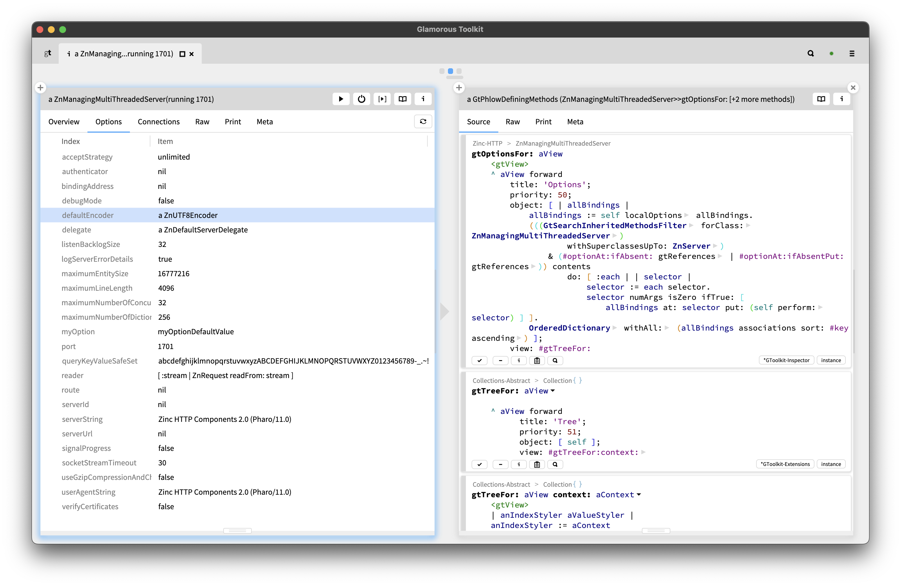

That is what the options view does. It combines options from two sources: as defined by the `ZnOptions` mechanism, but also as used in certain methods. The implementation of this view is rather complex but it show how source code meta tools can be leveraged. 

Some views only appear under certain, specific circumstances. For example when using the HTTP client for JSON REST interactions.

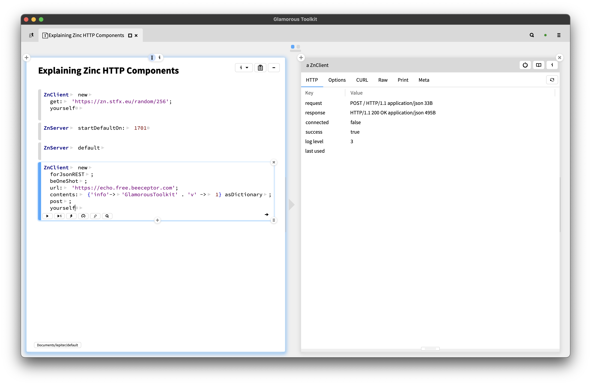

Note how both the request and response carry an entity of type application/json, which is what we wanted and how we configured the client. Incidentally, the beOneShot option closed the connection.

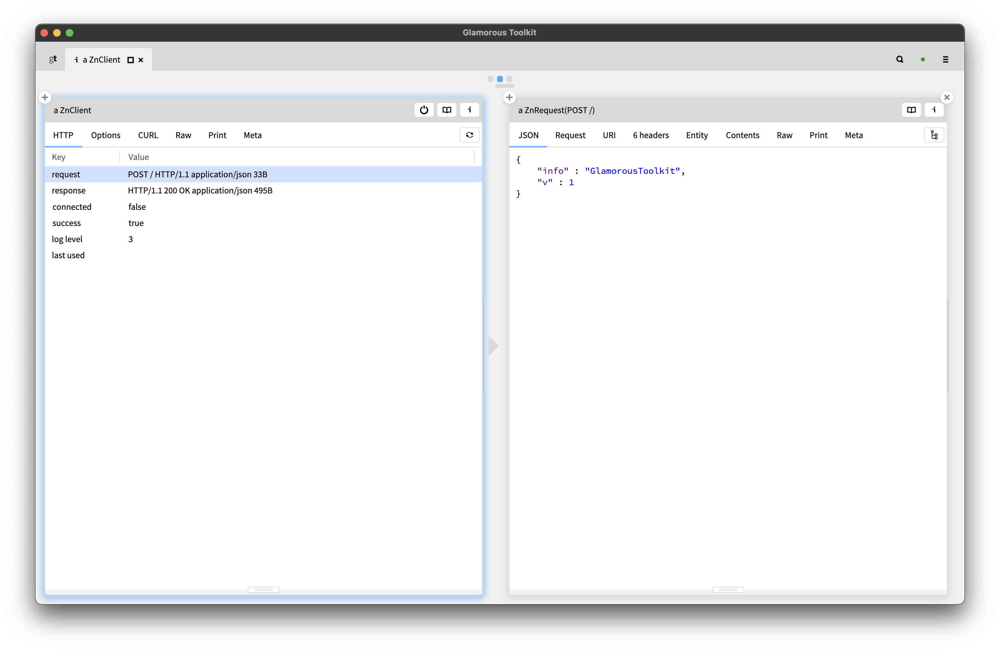

Now, a JSON view of the request shows a syntax colored, pretty printed version of the data we POSTed - first parsing it, then rendering it.

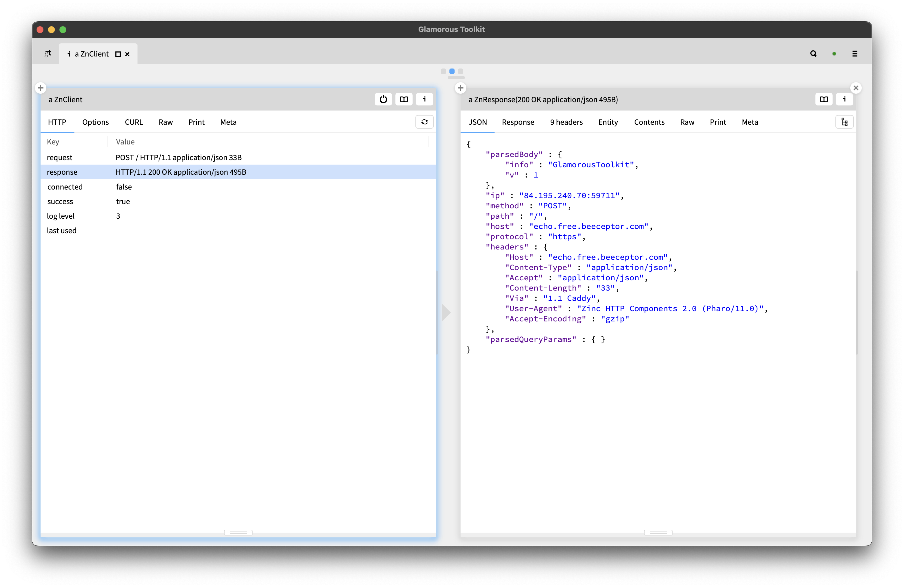

Similarly, the response gets the same view, this time showing the result. Both additions are minor, but can make real differences in practice. This is how you improve the tools for your context.

Zinc has an advanced logging system that emits real log objects, not just text. But it can be hard to grasp what that means. By using some other tools and combining them with custom views, the potential becomes clear.

Let’s start with monitoring `ZnClientLogEvent` objects and its subclasses.

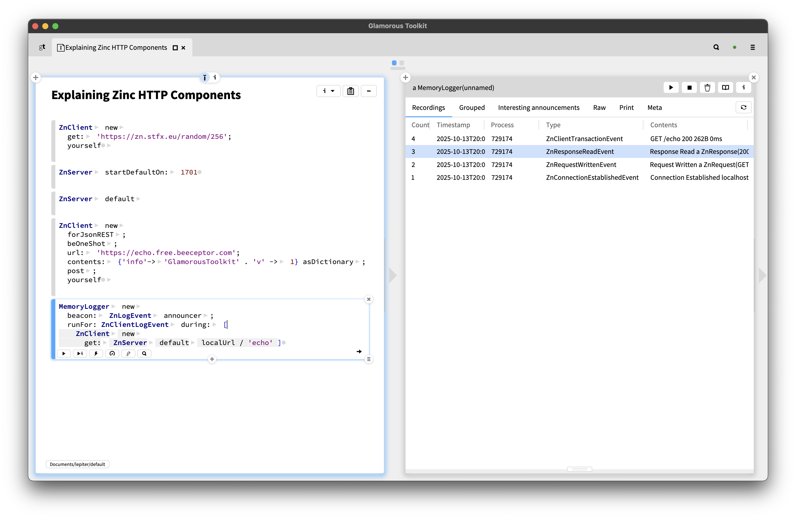

There were four events emitted, the newest is at the top. The connection is established, a request was written and a response  was read. Finally, the request/response pair is additionally combined in a transaction event.

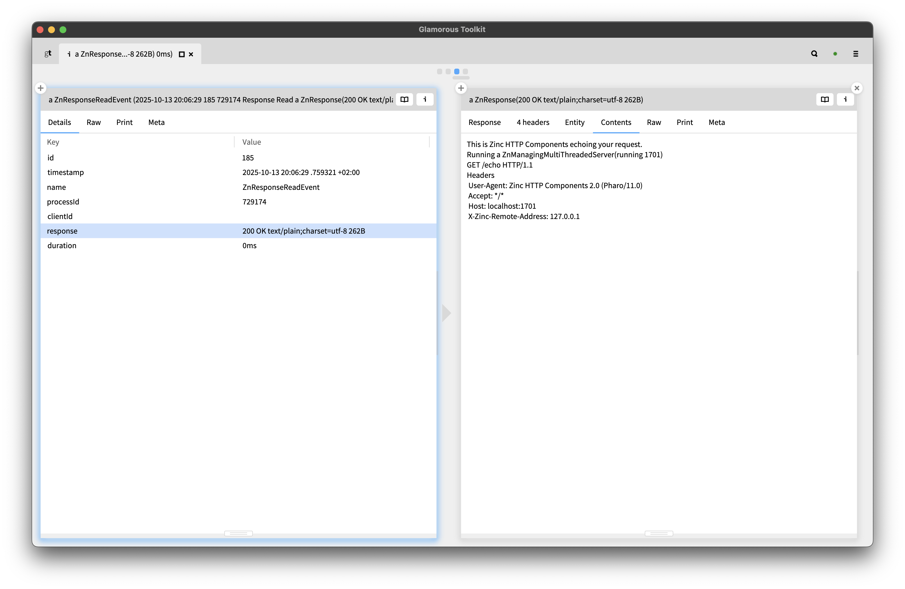

The key point here is that the event object contains the actual support objects used internally. In the screenshot above, we are looking at the response read event and inspect the actual response object and look at what got returned.

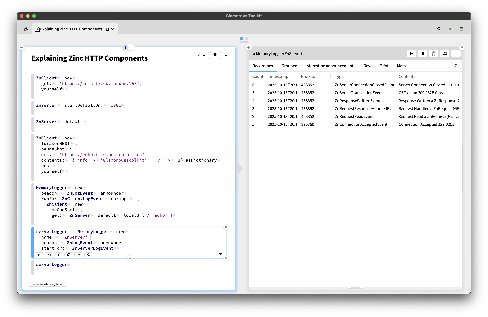

Above, we look at the log on the server side. You can see how the server listening process accepts and incoming connection and spawns a worker process to handle it. The request is read, handled to generate a response, the response is written, a request/response transaction is created and the connection is closed and the worker process stops.

This concludes our list of examples of how Zinc HTTP Components becomes better explainable through the addition of just a couple of custom views and actions. The point is not that these exist, it is that they are easy to add, that you should add them yourself for your domain objects to make your system easier to understand.
