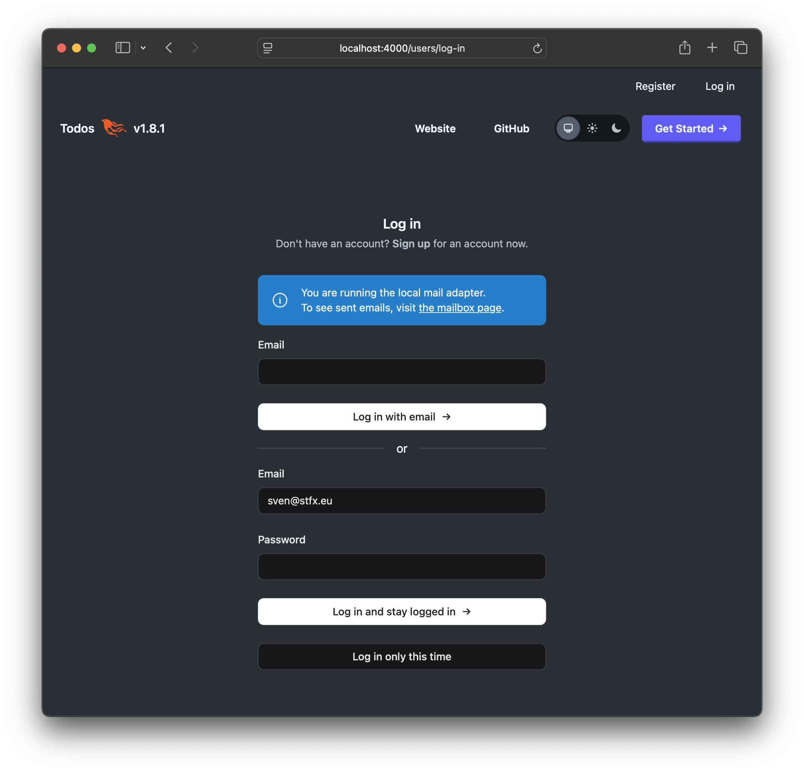
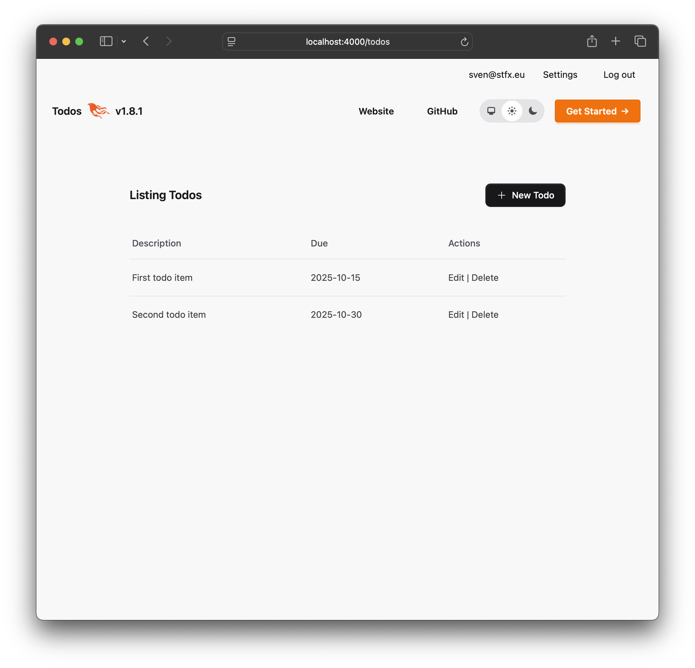
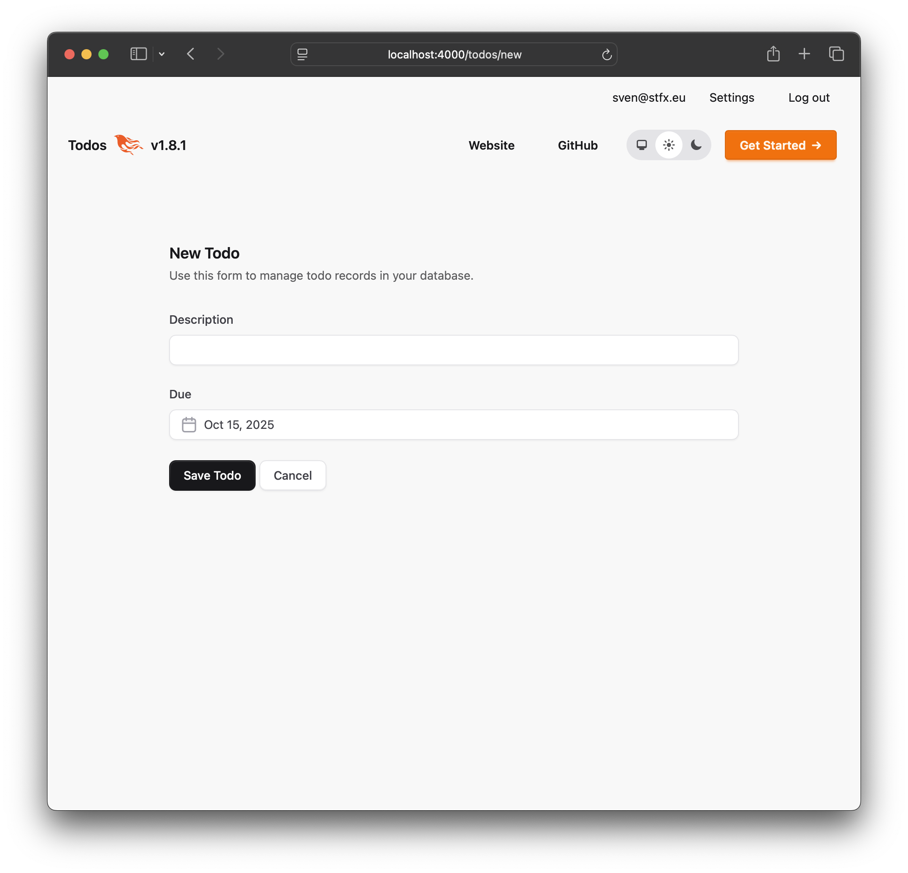
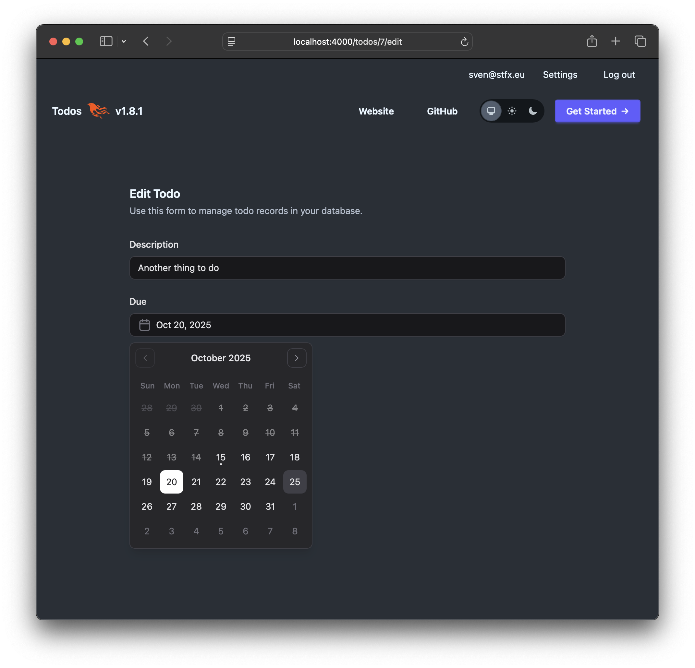

# A starter Phoenix LiveView project adapted to Fluxon UI

[Fluxon UI](https://fluxonui.com) is a commercial collection of web UI components for [Phoenix LiveView](https://phoenixframework.org) projects written by [Andriel Nuernberg](https://andrielfn.com). It only came out this year and I recently bought a license. Though there is great documentation I missed an example starter project to help in converting to it. After some experimentation, I created such a project, named `fluxonui_first`.

There are two goals: to give you something that works out of the box and to show you the detailed steps that led to it. The source code is available on GitHub in the [fluxonui_first](https://github.com/svenvc/fluxonui_first) repository.

As Fluxon UI is a commercial framework, you will need to [buy a license](https://fluxonui.com/pricing) and [install](https://fluxonui.com/getting-started/installation) its hex repo so that it shows up when you type `mix hex.repo list`.

The fluxonui_first project itself if very simple. `phx.gen` was used to create the project itself, add authentication and a simple todo list resource.

There are less than 10 commits that show exactly what changed. Some commits are the result of automatically generated code that was checked in as is. The other commits show the modifications to adapt to Fluxon UI.



The login screen and the other screens related to authentication look basically the same, though they *are* using enhanced implementations of `.button` and `.input` functional components. 



The `.table` and its subelements, `.table_head`, `.table_body` and `.table_row`, are quite different in use, though not necessarily more difficult to work with (see the [table documentation](https://fluxonui.com/components/table)). Here is the adapted code of the `render/1` of `FluxonUIFirstWeb.TodoLive.Index`.

```elixir
defmodule FluxonUIFirstWeb.TodoLive.Index do
  use FluxonUIFirstWeb, :live_view

  alias FluxonUIFirst.Todos

  @impl true
  def render(assigns) do
    ~H"""
    <Layouts.app flash={@flash} current_scope={@current_scope}>
      <.header>
        Listing Todos
        <:actions>
          <.button variant="solid" navigate={~p"/todos/new"}>
            <.icon name="hero-plus" /> New Todo
          </.button>
        </:actions>
      </.header>

      <.table id="todos">
        <.table_head>
          <:col>Description</:col>
          <:col>Due</:col>
          <:col>Actions</:col>
        </.table_head>
        <.table_body>
          <.table_row
            :for={{id, todo} <- @streams.todos}
            id={"##{id}"}
            phx-click={JS.navigate(~p"/todos/#{todo}")}
            class="cursor-pointer hover:bg-accent/50"
          >
            <:cell>{todo.description}</:cell>
            <:cell>{todo.due}</:cell>
            <:cell>
              <div class="sr-only">
                <.link navigate={~p"/todos/#{todo}"}>Show</.link> |
              </div>
              <.link navigate={~p"/todos/#{todo}/edit"}>Edit</.link>
              |
              <.link
                phx-click={JS.push("delete", value: %{id: todo.id}) |> hide("##{id}")}
                data-confirm="Are you sure?"
              >
                Delete
              </.link>
            </:cell>
          </.table_row>
        </.table_body>
      </.table>
    </Layouts.app>
    """
  end
end
```



The form to create or edit Todo items works as expected. Though there are more advanced options that are not used here.



For the date input, I used Fluxon UI’s much more advanced [date picker](https://fluxonui.com/components/date-picker), one of a family which also includes [date range](https://fluxonui.com/components/date-range-picker) and [date time](https://fluxonui.com/components/date-time-picker) pickers. Here is the code of the `render/1` of `FluxonUIFirstWeb.TodoLive.Form`.

```elixir
defmodule FluxonUIFirstWeb.TodoLive.Form do
  use FluxonUIFirstWeb, :live_view

  alias FluxonUIFirst.Todos
  alias FluxonUIFirst.Todos.Todo

  @impl true
  def render(assigns) do
    ~H"""
    <Layouts.app flash={@flash} current_scope={@current_scope}>
      <.header>
        {@page_title}
        <:subtitle>Use this form to manage todo records in your database.</:subtitle>
      </.header>

      <.form for={@form} id="todo-form" phx-change="validate" phx-submit="save">
        <div class="space-y-6">
          <.input field={@form[:description]} type="text" label="Description" />
          <.date_picker field={@form[:due]} label="Due" min={Date.utc_today()} />
          <footer>
            <.button phx-disable-with="Saving..." variant="solid">Save Todo</.button>
            <.button navigate={return_path(@current_scope, @return_to, @todo)}>Cancel</.button>
          </footer>
        </div>
      </.form>
    </Layouts.app>
    """
  end
end
```

Note how elegantly the `.date_picker` replaces a date input. Just one of its options is used here: to prevent dates in the past.

These are the steps and corresponding commits of the [fluxonui_first](https://github.com/svenvc/fluxonui_first) repository.

1. [Initial commit](https://github.com/svenvc/fluxonui_first/commit/29cc949616e0b223fa454d7a48eb321d0652ad95) automatically generated by GitHub
2. [mix phx.new . --module FluxonUIFirst --app fluxonui_first](https://github.com/svenvc/fluxonui_first/commit/5dad53ec147d404ec2fd4673091585ec38347af0) automatically generated by phx.new
3. [execute fluxon ui installation instructions](https://github.com/svenvc/fluxonui_first/commit/24db8cd353a4868b773e6eeb154c335c361bc350) [installation](https://fluxonui.com/getting-started/installation)
4. [mix phx.gen.auth Accounts User users --live](https://github.com/svenvc/fluxonui_first/commit/bf06c6a6ee12206ccbcc0d5b6aad08dd4c784c72) automatically generated by phx.gen.auth
5. [adapt generated auth UI to fluxon UI](https://github.com/svenvc/fluxonui_first/commit/5715ebdcf87de5a5d78df1472d449db333dd0dc9) some button and spacing changes
6. [mix phx.gen.live Todo todos description:string due:date](https://github.com/svenvc/fluxonui_first/commit/c26006b17c6b765f20f9b42caa88b0e840280392) automatically generated by phx.gen.live
7. [adapt router.ex, make / point to todos' index, add title to home menu](https://github.com/svenvc/fluxonui_first/commit/863c0e89c76917c1d50446bfea71b25e9c453a23) and [fix mistake in router.ex](https://github.com/svenvc/fluxonui_first/commit/21f8e684bac9e170ffdc3fcb829103c2884b0d56) integrate todos’ routes and some finishing touches
8. [adapt generated todo UI to fluxon UI](https://github.com/svenvc/fluxonui_first/commit/14b213e5e3dd5b718358ce78f5d40681ea04d5d6) some button and spacing changes, using the date picker, and the new table component

To run this project from scratch under development, the following standard steps should be sufficient (provided Fluxon UI is installed as hex.repo and PostgreSQL is present and locally accessible without password).

```console
$ git clone https://github.com/svenvc/fluxonui_first.git
$ cd fluxonui_first 
$ mix setup
$ iex -S mix phx.server
```

Finally visit [http://localhost:4000](http://localhost:4000), register via fake email, confirm via the login link sent to the fake mailbox [http://localhost:4000/dev/mailbox/](http://localhost:4000/dev/mailbox/).
