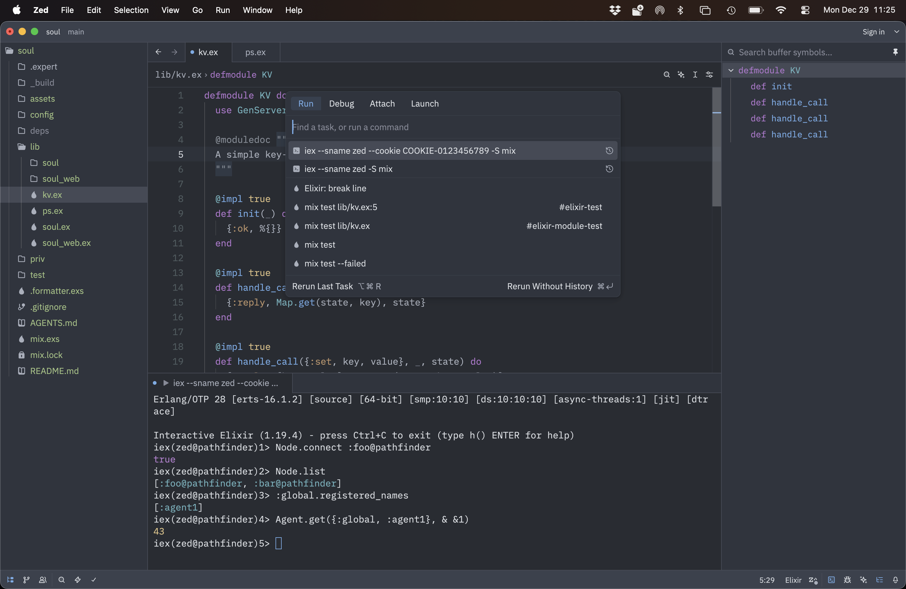

# Exploring Distributed Elixir

An [Elixir](https://elixir-lang.org) program consist of 
a large number of lightweight, concurrent processes
communicating with each other via asynchronous messages.
A process receives and handles incoming messages,
transforming its internal state in a functional way.
Inside a process, all code is sequential.
The VM running Elixir, [BEAM](https://en.wikipedia.org/wiki/BEAM_(Erlang_virtual_machine)),
normally utilizes all cores of a modern CPU and schedules processes for execution.
By running many concurrent processes you can maximize the performance of current hardware.

What if we want to use more than one machine?
Distributed Elixir refers to the capability of Elixir applications 
to run across multiple nodes within a cluster, 
allowing for improved scalability and fault tolerance. 
This is a complex subject, but we can explore the basics without installing any dependencies.

You create a distributed cluster, on the same machine or on machines on the same network,
by starting one or more nodes, giving each node a name, making sure they share the same secret,
and then connecting those nodes. 
Let's begin and start our first node, `foo`, 
using functions from the [Node](https://hexdocs.pm/elixir/main/Node.html) module.

```console
$ iex --sname foo --cookie COOKIE-0123456789

iex(foo@pathfinder)1> Node.self
:foo@pathfinder
iex(foo@pathfinder)2> Node.get_cookie
:"COOKIE-0123456789"
```

Now we start our second node, `bar` and connect it to the first node.

```console
$ iex --sname bar --cookie COOKIE-0123456789

iex(bar@pathfinder)1> Node.connect :foo@pathfinder
true
iex(bar@pathfinder)2> Node.list
[:foo@pathfinder]
```

Both nodes now know each other. When either node dies, the connection disappears.

```console
iex(foo@pathfinder)3> Node.list
[:bar@pathfinder]
```

What Distributed Elixir fundamentally offers is the ability 
to send asynchronous messages to processes living on other nodes. 
The great thing, the magic, is that this happens transparently.
It looks exactly the same as sending a message to a local process.

OK, but how do we get started, exactly ?
We need a way to refer to a remote process.
For this we can use Erlang's [global](https://www.erlang.org/doc/apps/kernel/global.html) module.
This is a distributed registry for processes.
It is simple but powerful.
It keeps local registries in sync with each other so that they share one global view, 
without a central storage point.

Let's use the [Agent](https://hexdocs.pm/elixir/main/Agent.html) module an an example.
This is a process that holds a value that can be queried or updated.
On our `foo` node, we create an `agent1` and give it a value.
Note how set the name through the global registry.

```console
iex(foo@pathfinder)4> Agent.start(fn -> 42 end, name: {:global, :agent1})
{:ok, #PID<0.117.0>}
iex(foo@pathfinder)5> :global.registered_names
[:agent1]
```

The `bar` node has automatically sees the same global registry.
We can now refer to `agent1`, living remotely, and use it as if it were a local one.

```console
iex(bar@pathfinder)3> :global.registered_names
[:agent1]
iex(bar@pathfinder)4> Agent.get({:global, :agent1}, fn x -> x end)
42
iex(bar@pathfinder)5> Agent.update({:global, :agent1}, fn x -> x + 1 end)
:ok
```

Any change that we make from `bar` is visible on `foo`, of course.

```console
iex(foo@pathfinder)6> Agent.get({:global, :agent1}, fn x -> x end)
43
```

Please consider what is all happening here.
The code of the Agent module knows nothing about distributed processes,
as we will demonstrate later with our own code.
Communication goes via the network, 
the message is serialized on one end and materialized on the other end.
The message does not just contain data, it contains a function.
We get a result from a remote call, 
from code that doesn't know it is no longer working locally.

The starting point of this magic lies in the nature of PIDs.

```console
iex(foo@pathfinder)7> :global.whereis_name :agent1
#PID<0.117.0>

iex(bar@pathfinder)6> :global.whereis_name :agent1
#PID<13530.117.0>
```

The PID of `agent1` is different on both nodes.
The first number is zero for local processes,
and some number referring to a node for remote processes,
while the second number remains the same.
When the VM needs to send a message, it uses this to do something different.

Let's write some code of our own to drive home the point 
that working with remote processes happens transparently.
At the moment my favourite IDE for Elixir is [Zed](https://zed.dev).
Here we run another node inside Zed and add it to our existing cluster.



Here is a log of the interaction inside Zed, from the screenshot above.

```console
$ iex --sname zed --cookie COOKIE-0123456789 -S mix

iex(zed@pathfinder)1> Node.connect :foo@pathfinder
true
iex(zed@pathfinder)2> Node.list
[:foo@pathfinder, :bar@pathfinder]
iex(zed@pathfinder)3> :global.registered_names
[:agent1]
iex(zed@pathfinder)4> Agent.get({:global, :agent1}, & &1)
43
```

Note how we connect to the cluster by referring to `foo`,
yet we immediately see `bar` as well.
Furthermore, the global registry is immediately available to us,
and we can use the existing `agent1`.

Let's try a super simple key value [GenServer](https://hexdocs.pm/elixir/main/GenServer.html).

```elixir
defmodule KV do
  use GenServer
  
  @moduledoc """
  A simple key-value server.
  """

  @impl true
  def init(_) do
    {:ok, %{}}
  end

  @impl true
  def handle_call({:get, key}, _, state) do
    {:reply, Map.get(state, key), state}
  end

  @impl true
  def handle_call({:set, key, value}, _, state) do
    {:reply, true, Map.put(state, key, value)}
  end

  @impl true
  def handle_call(:keys, _, state) do
    {:reply, Map.keys(state), state}
  end
end
```

Again, using the different naming scheme is enough to publish our process to the cluster.

```console
iex(zed@pathfinder)5> GenServer.start(KV, nil, name: {:global, :kv1})
{:ok, #PID<0.332.0>}
iex(zed@pathfinder)6> GenServer.call({:global, :kv1}, {:set, :foo, 123})
true
```

Now any node on the cluster can access `kv1`.

```console
iex(foo@pathfinder)8> GenServer.call({:global, :kv1}, {:get, :foo})
123
```

Our three nodes are running on the same machine.
Using another machine is just as easy.

```console
sven@pathfinder ~ $ ssh enterprise
Last login: Tue Dec 23 14:46:45 2025 from 192.168.178.103
sven@enterprise ~ $ iex --sname mini --cookie COOKIE-0123456789
Erlang/OTP 28 [erts-16.1.2] [source] [64-bit] [smp:10:10] [ds:10:10:10] [async-threads:1] [jit] [dtrace]

Interactive Elixir (1.19.4) - press Ctrl+C to exit (type h() ENTER for help)
iex(mini@enterprise)1> Node.connect :foo@pathfinder
true
iex(mini@enterprise)2> Node.list
[:foo@pathfinder, :zed@pathfinder, :bar@pathfinder]
iex(mini@enterprise)3> GenServer.call({:global, :kv1}, {:get, :foo})
123
```

As you probably know, GenServer's call function uses asynchronous messages 
to give the impression that we have a RPC call with a synchroneous request and response.
It refers to the caller process, which is remote from the standpoint of the server's implementation.
When a message send transfers from one node to another,
any PID's inside it are converted from local on the caller to remote for the callee.

To explore this inverse referencing, we can try to implement a simple 
[PubSub](https://hexdocs.pm/phoenix_pubsub/Phoenix.PubSub.html) GenServer.
BTW, the Phoenix version is also cluster aware, we're doing this as an experiment.
Here is the first version of the code.

```elixir
defmodule PS do
  use GenServer

  @moduledoc """
  A simple publish-subscribe server
  """

  @impl true
  def init(_) do
    {:ok, %{}}
  end

  @impl true
  def handle_call({:subscribe, topic}, {sender, _call}, state) do
    new_state =
      Map.update(state, topic, [sender], fn subscribers ->
        if Enum.member?(subscribers, sender) do
          subscribers
        else
          [sender | subscribers]
        end
      end)

    {:reply, true, new_state}
  end

  @impl true
  def handle_call({:unsubscribe, topic}, {sender, _call}, state) do
    new_state =
      Map.update(state, topic, [], fn subscribers ->
        Enum.reject(subscribers, fn x -> x == sender end)
      end)

    {:reply, true, new_state}
  end

  @impl true
  def handle_call({:subscribers, topic}, _sender, state) do
    subscribers = Map.get(state, topic, [])

    {:reply, subscribers, state}
  end

  @impl true
  def handle_call({:broadcast, topic, message}, {sender, _call}, state) do
    Map.get(state, topic, [])
    |> Enum.each(fn subscriber ->
      if subscriber != sender do
        Process.send(subscriber, message, [])
      end
    end)

    {:reply, true, state}
  end
end
```

The `subscribe` and `unsubscribe` implementations use the call's sender to get the PID
to update the internal state.
When doing a `broadcast`, each subscriber is sent the same message using standard `Process.send/3`.
We exclude the sender, one of the possible semantics.

Let's see how this works in practice: in our three node cluster, 
we subscribe each node to the same `topic1` and broadcast a message from `zed`.

```console
iex(zed@pathfinder)7> GenServer.start(PS, nil, name: {:global, :ps1})
{:ok, #PID<0.362.0>}
iex(zed@pathfinder)8> GenServer.call({:global, :ps1}, {:subscribe, :topic1})
true
```

The PID that subscribes is the one from IEX itself.

```console
iex(foo@pathfinder)9> GenServer.call({:global, :ps1}, {:subscribe, :topic1})
true
iex(foo@pathfinder)10> self
#PID<0.110.0>
iex(foo@pathfinder)11> GenServer.call({:global, :ps1}, {:subscribers, :topic1})
[#PID<0.110.0>]
```

With three nodes subscribed, we can check out the list of subscribers.
Note the node part of each PID.

```console
iex(bar@pathfinder)8> GenServer.call({:global, :ps1}, {:subscribe, :topic1})
true
iex(bar@pathfinder)9> GenServer.call({:global, :ps1}, {:subscribers, :topic1})
[#PID<0.110.0>, #PID<13530.110.0>, #PID<14801.307.0>]
```

The node part of a PID is different on each node,
i.e. each node uses a different remote identifier.
Remember that PID's get translated when they transfer from node to node.

```console
iex(foo@pathfinder)12> GenServer.call({:global, :ps1}, {:subscribers, :topic1})
[#PID<14487.110.0>, #PID<0.110.0>, #PID<14630.307.0>]
```

We can now broadcast a message from `zed`, 
where we do *not* receive it ourselves since we explicitly exclude the sender.

```console
iex(zed@pathfinder)9> GenServer.call({:global, :ps1}, {:broadcast, :topic1, {:msg, :yo}})
true
iex(zed@pathfinder)10> flush
:ok
```

On the other nodes we *do* receive the message as expected.

```console
iex(foo@pathfinder)13> flush
{:msg, :yo}
:ok

iex(bar@pathfinder)10> flush
{:msg, :yo}
:ok
```

Our simple PubSub implementation is way too simple.
One issue is the following: when a node dies, its PID is left stranded in the subscribers lists.
On itself, that is no problem as sending a message to a non-existing or dead process is a no-op.
But we can fix this, demonstrating yet another strong point about Distributed Elixir.

You probably know that one process can be linked to another process,
in which case the dead of the second process will kill the first one,
which we do not want here.
The other option is for one process to monitor another process,
in which case the monitoring process will receive a specific message 
when a monitored process dies.

This is the second, extended version of our code.
The subscribe call implementation is extended to call `Process.monitor/1`.
Finally we add an info implementation to deal with the `DOWN` message
and remove the PID from any subscribers list.
We do not have to differenciate between normal and abnormal exits.

```elixir
defmodule PS do
  use GenServer

  @moduledoc """
  A simple publish-subscribe server
  """

  @impl true
  def init(_) do
    {:ok, %{}}
  end

  @impl true
  def handle_call({:subscribe, topic}, {sender, _call}, state) do
    new_state =
      Map.update(state, topic, [sender], fn subscribers ->
        if Enum.member?(subscribers, sender) do
          subscribers
        else
          [sender | subscribers]
        end
      end)

    Process.monitor(sender)

    {:reply, true, new_state}
  end

  @impl true
  def handle_call({:unsubscribe, topic}, {sender, _call}, state) do
    new_state =
      Map.update(state, topic, [], fn subscribers ->
        Enum.reject(subscribers, fn x -> x == sender end)
      end)

    {:reply, true, new_state}
  end

  @impl true
  def handle_call({:subscribers, topic}, _sender, state) do
    subscribers = Map.get(state, topic, [])

    {:reply, subscribers, state}
  end

  @impl true
  def handle_call({:broadcast, topic, message}, {sender, _call}, state) do
    Map.get(state, topic, [])
    |> Enum.each(fn subscriber ->
      if subscriber != sender do
        Process.send(subscriber, message, [])
      end
    end)

    {:reply, true, state}
  end

  @impl true
  def handle_info({:DOWN, _ref, :process, process, reason}, state) do
    IO.puts("DOWN #{inspect(process)} for reason #{inspect(reason)}")

    new_state =
      Map.new(state, fn {topic, subscribers} ->
        {topic, Enum.reject(subscribers, fn subscriber -> subscriber == process end)}
      end)

    {:noreply, new_state}
  end
end
```

Here is what we see on node `zed` when `mini` subscribes and then disappears.

```console
iex(zed@pathfinder)12> Node.list
[:foo@pathfinder, :bar@pathfinder, :mini@enterprise]
iex(zed@pathfinder)13> GenServer.call({:global, :ps1}, {:subscribers, :topic1})
[#PID<27407.110.0>, #PID<26976.110.0>, #PID<26695.110.0>, #PID<0.307.0>]
DOWN #PID<27407.110.0> for reason :noconnection
iex(zed@pathfinder)14> GenServer.call({:global, :ps1}, {:subscribers, :topic1})
[#PID<26976.110.0>, #PID<26695.110.0>, #PID<0.307.0>]
iex(zed@pathfinder)15> Node.list
[:foo@pathfinder, :bar@pathfinder]
```

`#PID<27407.110.0>` got removed from the list of subscribers and `mini` left the cluster.
Again, how cool is it that process monitoring works across nodes of a cluster!

The source code for this and other experiments can be found in the [distributed_elixir_exploration](https://github.com/svenvc/distributed_elixir_exploration) repository.

There is much more to learn about Distributed Elixir,
here are some references to get you started:

- [libcluster](https://hexdocs.pm/libcluster/readme.html) automatic cluster formation & healing
- [partisan](https://hexdocs.pm/partisan/readme.html) greater scalability & reduced latency for clusters
- [syn](https://hexdocs.pm/syn/readme.html) an evolution of Erlang's global and pg modules
- [Horde](https://hexdocs.pm/horde/getting_started.html) distributed supervisor & registry
- [Broadway](https://hexdocs.pm/broadway/introduction.html) data ingestion & processing pipelines
- [PubSub](https://hexdocs.pm/phoenix_pubsub/Phoenix.PubSub.html) realtime publisher & subscriber service

It is also important to mention the 
[Fallacies of distributed computing](https://en.wikipedia.org/wiki/Fallacies_of_distributed_computing): 
communication between nodes in a cluster works so good it seems like magic, but it can fail. 
The good thing is, Elixir's philosophy is to always assume possible failures,
even when doing local communication.
